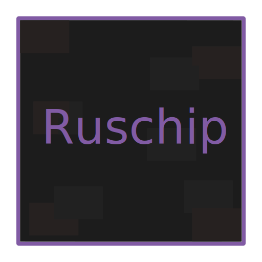

## Ruschip - A CHIP-8 Emulator written in Rust

<p align="center">
    
</p>

### Features
- Supports multiple CHIP-8 variants (planned not added)
- Supports most--if not all--of the quirks, and they can be toggled
- Supports customization of display colors
- Supports the loading of custom CHIP-8 fonts

### Emulator Specifications
- Passes all the tests from [Timendus/chip8-test-suite (v4.0)](https://github.com/Timendus/chip8-test-suite)
- Runs @ 720 Hz (12 instructions per frame, 60 frames per second)
- The CHIP-8 call stack doesn't have a maximum size limit
- Follows the standard CHIP-8 specifications; see [this](http://devernay.free.fr/hacks/chip8/C8TECH10.HTM#2.0) and [this](#Issues) for more details

### Usage
checkout `ruschip --help` for usage information

### Compilation

You might want to use the pre-built binaries provided [here](https://github.com/SegmentationViolator/Ruschip/releases/)

#### Requirements

- [mold](https://github.com/rui314/mold) linker
- rust compiler (rustc) and cargo
- git or Github cli (gh)

1. Clone this repository
```sh
gh repo clone SegmentationViolator/Ruschip
```

OR

```sh
git clone https://github.com/SegmentationViolator/Ruschip.git
```

2. Install dependencies, compile the binary and install it
```sh
cargo install --path Ruschip
```

For pasting it all at once
```
git clone https://github.com/SegmentationViolator/Ruschip.git
cargo install --path Ruschip
```

### Issues
Known issues:
- The sound and delay timers might be a bit inconsistent as they depend on the frame rate being 60 fps
- The emulator is not able to emulate [this](https://johnearnest.github.io/chip8Archive/play.html?p=RPS) rom properly;
  check [#1](https://github.com/SegmentationViolator/Ruschip/issues/1) for more details
